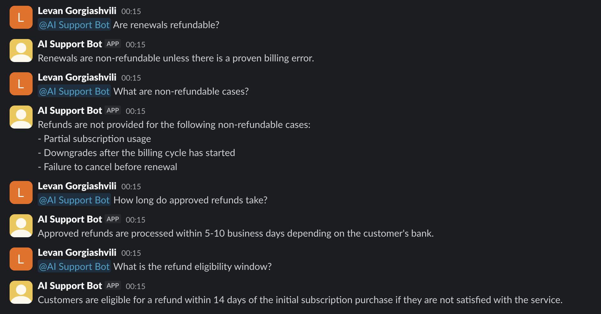

# AI Support Slack Bot (RAG-Powered)

Production-deployed Slack bot that answers workspace questions using Retrieval-Augmented Generation (RAG) over a vector database.

---

## Overview

This project implements a Slack bot that:

- Listens to `app_mention` events via Slack Events API
- Verifies Slack request signatures for security
- Retrieves relevant context from a Chroma vector database
- Generates responses using OpenAI
- Sends answers back to Slack in real time
- Runs in production on Render

---

## Architecture

Slack → FastAPI Backend → Signature Verification →  
Vector Retrieval (ChromaDB) → OpenAI → Slack Response

---

## Tech Stack

- Python
- FastAPI
- OpenAI API
- ChromaDB (Vector Database)
- Slack Events API
- Render (Cloud Deployment)

---

## Security

- Slack HMAC signature verification
- Environment-based secret management
- No API keys stored in repository
- Replay attack protection

---

## Deployment

Live backend deployed on Render.

Free-tier cold start handling implemented using background task processing to comply with Slack’s 3-second response requirement.

---

## Key Engineering Challenges Solved

- Slack 3-second timeout constraint
- Background task processing for LLM calls
- Production deployment with environment variables
- Secure API key handling
- Vector database ingestion and retrieval logic

---

## Status

Production-ready Slack bot successfully deployed and integrated.

## Demo

